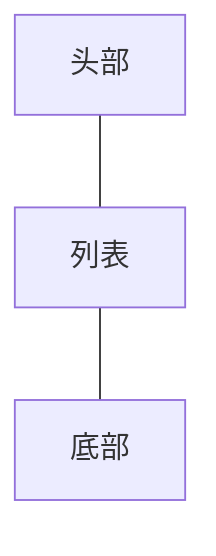
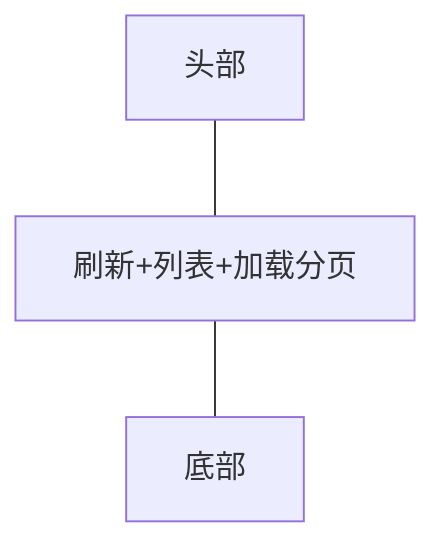
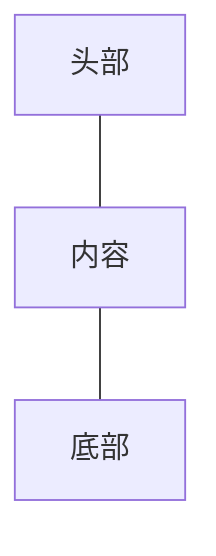

#### 常用框架组件
├── HFRecyclerVModel.kt
├── HFSRecyclerVModel.kt
├── HeaderContentFooterVModel.kt
├── HeaderListFooterVModel.kt
├── HeaderFooterVModel.kt
└── StateViewModel.kt


#### 注意：该包下的ViewModel，请勿使用在RecyclerView中

#### HFRecyclerVModel 适用布局
+ 适用结构


+ 说明
 ```
 0、需要子类继承该类，方可使用
 1、头部和底部是可选的，根据页面结构，决定是否添加对应ViewModel即可
 2、顶层父类都有实现StateViewModel，默认支持页面各种状态切换
 ```


#### HFSRecyclerVModel 适用布局
+ 适用结构


+ 说明
 ```
 0、需要子类继承该类，方可使用
 1、头部和底部是可选的，根据页面结构，决定是否添加对应ViewModel即可。
 2、刷新和分页加载，也可根据场景，进行开启/禁用
 3、顶层父类都有实现StateViewModel，默认支持页面各种状态切换
 ```


#### HeaderContentFooterVModel 适用布局
+ 适用结构


+ 说明
 ```
 0、需要子类继承该类，方可使用
 1、内容部分未实现，继承该类后，需要根据自己的需求去绑定自己的ViewModel
 2、刷新和分页加载，也可根据场景，进行开启/禁用
 3、顶层父类都有实现StateViewModel，默认支持页面各种状态切换
 ```
